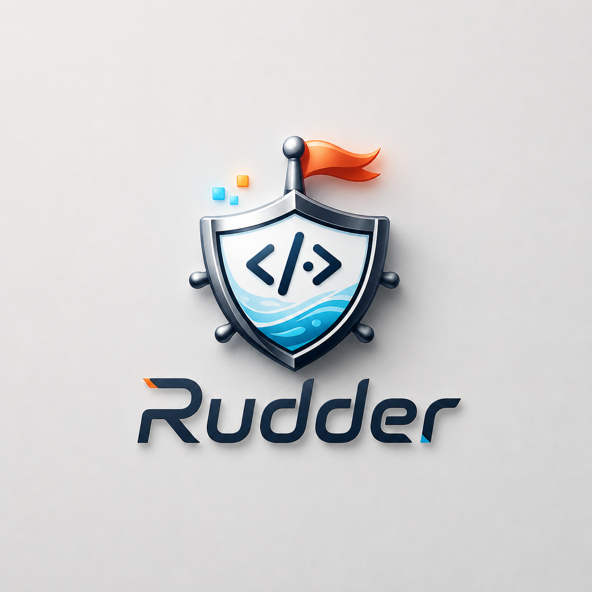

<p align="center">
<picture>
<source srcset="assets/rudder-logo.png" media="(prefers-color-scheme: dark)">
<source srcset="assets/rudder-logo.png" media="(prefers-color-scheme: light)">

</picture>
</p>

<p align="center">
<strong>Your AI coding assistant keeps forgetting your project? This fixes that.</strong><br/>
<sub>Start a feature in Gemini, continue in Claude Code, hand it off to a teammate — no one needs to re-explain everything. Context, specs, and standards live in your repo and get injected automatically.</sub>
</p>

<p align="center">
<a href="./README_CN.md">简体中文</a>
</p>

<p align="center">
<a href="https://www.npmjs.com/package/@mengde1231/rudder"></a>
<a href="https://www.npmjs.com/package/@mengde1231/rudder"></a>
<a href="https://github.com/MengDe1231/Rudder/blob/main/LICENSE"></a>
<a href="https://github.com/MengDe1231/Rudder/stargazers"></a>
</p>

## What problem does this solve?

If you've used AI for coding, you know the drill: every new session the assistant has no idea about your project. You explain the same things over and over.

Rudder fixes that. **Your specs, memory, and task state all live in the repo. Every session gets exactly the context it needs — automatically.**

| Capability | What it changes |
| --- | --- |
| **Auto-injected specs** | Write your conventions once in `.rudder/spec/`, Rudder injects the right files into each session. No more copy-pasting rules every time. |
| **Task-centered flow** | PRDs, implementation records, and review context all live in `.rudder/tasks/`. AI work stays structured, not scattered across chat history. |
| **Project memory** | `.rudder/workspace/` journals carry forward what happened last time. New session? It knows where you left off. |
| **Team-shared standards** | Specs version-control with your code. One person figures out a good pattern, everyone gets it for free. |
| **14 platforms, one setup** | Same Rudder structure everywhere. Switch tools, keep your workflow. |

## Supported Platforms

14 AI coding platforms, one setup. Pick what you use:

| Agent | IDE / Platform |
| --- | --- |
| Claude Code | CLI, VS Code, JetBrains, Web |
| Gemini | Gemini CLI |
| Cursor | Cursor IDE |
| Codex | VS Code |
| OpenCode | OpenCode IDE |
| CodeBuddy | CodeBuddy IDE |
| Qoder | Qoder IDE |
| Kiro | Kiro IDE |
| Pi | Pi CLI |
| Windsurf | Windsurf IDE |
| Copilot | VS Code, JetBrains |
| Antigravity | Antigravity CLI |
| Kilo | Kilo CLI |
| Droid | Factory IDE |

## What you need

- **Node.js** >= 18
- **Python** >= 3.9

## Quick Start

```bash
# 1. Install
npm install -g @mengde1231/rudder@latest

# 2. Initialize (all platforms)
rudder init -u your-name

# 3. Or just the ones you actually use (cleaner)
rudder init --cursor --opencode --codex -u your-name
```

## How it works

Rudder runs a 4-phase loop every session:

1. **Plan** — `rudder-brainstorm` walks through requirements and writes `prd.md`. Research-heavy stuff goes to a `rudder-research` sub-agent. Output: curated specs + research files, wired up via `implement.jsonl` / `check.jsonl`.
2. **Implement** — `rudder-implement` writes code from the PRD with context already injected. No git commit here — that's intentional.
3. **Verify** — `rudder-check` reviews the diff against specs, runs lint, type-check, compile, and tests. Fixes what it can, reports what it can't.
4. **Finish** — `rudder-update-spec` promotes new learnings back into `.rudder/spec/` so the next session starts smarter.

## FAQ

<details>
<summary><strong>How is this different from <code>CLAUDE.md</code>, <code>AGENTS.md</code>, or <code>.cursorrules</code>?</strong></summary>

Those are useful entry points — until they become 3,000-line monoliths nobody reads. Rudder layers things: scoped specs, per-task PRDs, workflow gates, cross-platform adapters. <strong>One simple rule: don't cram everything into one file.</strong>

</details>

<details>
<summary><strong>Is Rudder only for Claude Code?</strong></summary>

Nope. Rudder is a project-layer thing. Works across 14 coding agents and IDEs. Use Gemini for frontend today, Claude Code for backend tomorrow, Codex for review the day after.

</details>

<details>
<summary><strong>Solo dev or team?</strong></summary>

Both. Solo devs get project memory and repeatable workflow. Teams get the bigger win: shared standards, clear task boundaries, reviewable context, and platform portability.

</details>

<details>
<summary><strong>Do I have to write every spec file by hand?</strong></summary>

Nope. Most teams let AI draft specs from existing code first, then tighten the important stuff by hand. Rudder works best when the high-signal rules are explicit and versioned — the rest AI can figure out.

</details>

<details>
<summary><strong>Will this cause merge conflicts in a team?</strong></summary>

Nah. Personal workspace journals are per-developer. Shared specs and tasks go through git like any other artifact — merge conflicts are just merge conflicts, nothing new.

</details>

## Star History

[](https://star-history.com/#MengDe1231/Rudder&Date)

<p align="center">
<a href="https://github.com/MengDe1231/Rudder">GitHub</a> •
<a href="https://discord.com/invite/tWcCZ3aRHc">Discord</a> •
<a href="https://github.com/MengDe1231/Rudder/blob/main/LICENSE">AGPL-3.0 License</a>
</p>
